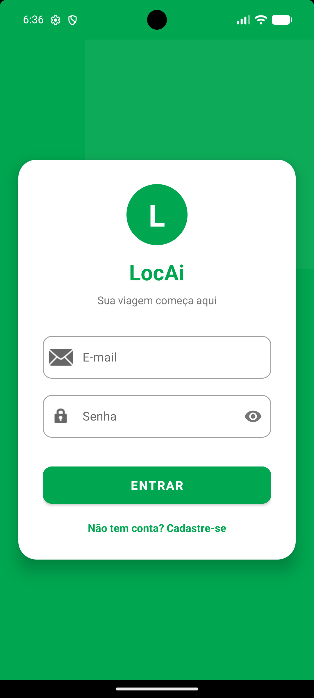
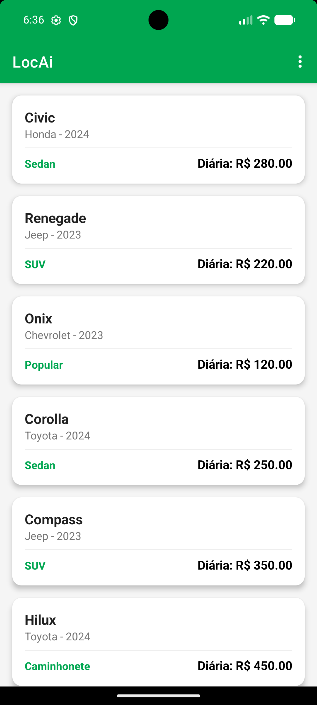

# LocAi - Sistema de Locação de Veículos

## Descrição da Proposta
O **LocAi** é um aplicativo Android desenvolvido para simular uma locadora de carros funcional. O projeto foca em uma experiência de usuário (UX) moderna, inspirada em grandes locadoras, permitindo o gerenciamento completo desde o cadastro até o relatório final de locações.

## Tecnologias Utilizadas
- **Linguagem:** Kotlin
- **IDE:** Android Studio
- **Banco de Dados:** Room (Persistência Local SQLite com Migração e Pré-população)
- **UI/UX:** XML Layouts, Material Design 3, View Binding, Custom Drawables
- **Concorrência:** Kotlin Coroutines (LifecycleScope)
- **Controle de Versão:** Git & GitHub

## Arquitetura Adotada
O projeto utiliza uma arquitetura baseada em componentes do Android Jetpack:
- **Model:** Entidades do banco de dados (`Usuario`, `Carro`, `Locacao`, `LocacaoComDetalhes`).
- **DAO:** Interfaces para operações de CRUD e consultas complexas com `INNER JOIN`.
- **Database:** Singleton com suporte a múltiplas versões e pré-carregamento de frota.
- **Adapters:** Gerenciamento eficiente de listas dinâmicas (RecyclerView).

## Funcionalidades Implementadas
- **Autenticação Segura:** Login e cadastro com persistência de sessão via `SharedPreferences`.
- **Interface Moderna:** Tela de login decorada com Material Cards, ícones e design responsivo.
- **Gestão de Frota:** Listagem de 7 modelos (Onix, Corolla, Compass, Hilux, HB20, Civic e Renegade).
- **Simulação de Aluguel:** Cálculo automático de valores com base em datas (Diárias + Taxa fixa de R$ 50,00).
- **Relatório de Aluguéis:** Histórico detalhado contendo modelo do carro, nome do locatário, período e **horário exato do registro**.
- **Acessibilidade:** Implementação de `contentDescription` e navegação facilitada com botões de retorno em todas as telas.
- **Padronização Visual:** Tema forçado em modo claro para garantir visibilidade e contraste em qualquer dispositivo.

## Telas do Aplicativo
Aqui estão as capturas de tela do sistema em funcionamento:

  
  
  
  

## Integrante
- Otávio Martins Marques
